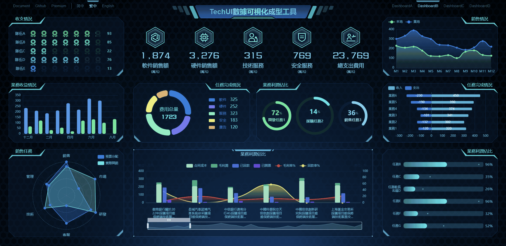
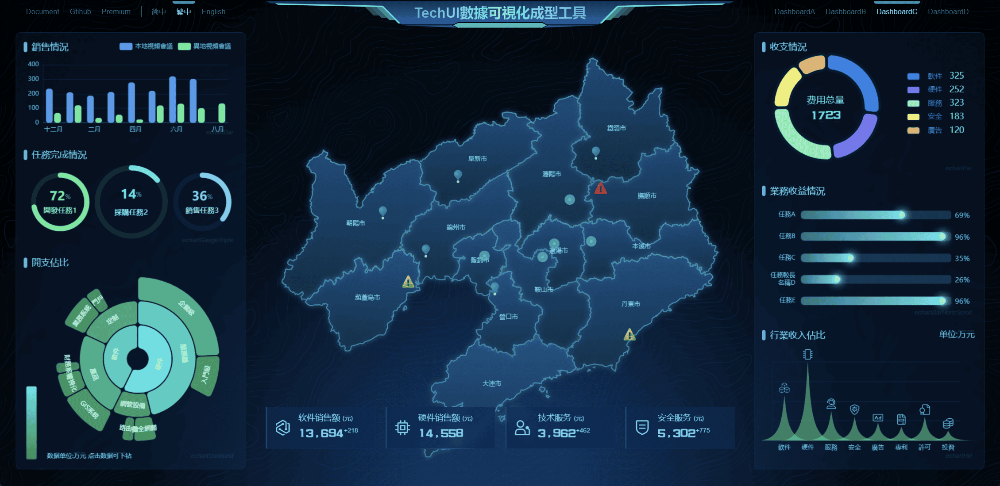
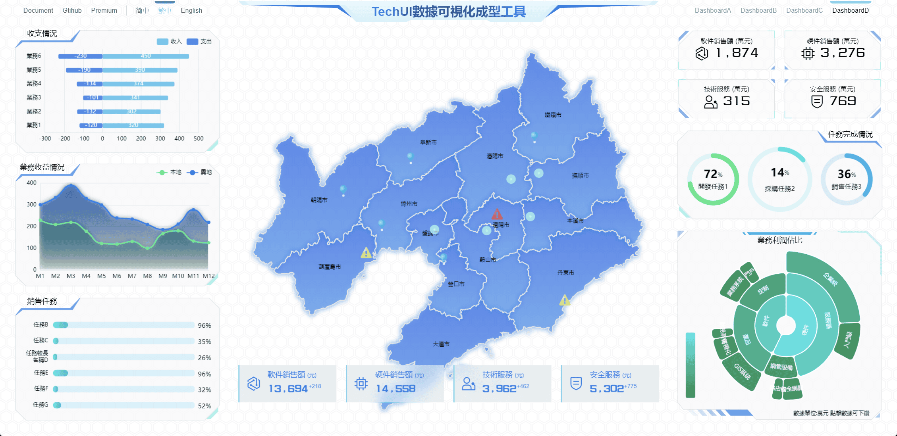

[简体中文](./README.cn.md) | 繁體中文 | [English](./README.md)

<h1 align="center">
<b>TechUI-lite 開發包</b>
</h1>

TechUI-lite是一款免費簡單易用的動態SVG可視化大屏開發框架，基於vite+vue3開發

  <a href="https://lite.techui.net/docs">文檔</a> •
  <a href="https://lite.techui.net/">演示站</a> •
  <a href="https://www.npmjs.com/package/techui-vue3-lite">核心庫</a> •
  <a href="https://techui.net/docs">高級版</a> •
  <a href="https://t.me/ayin86cn">Telgram</a>

## 🛡️公告

**techUI-Lite框架完全免費，自由使用，其核心文件非開源，發佈在NPM服務器**

還有一款付費Premium版本，提供了更多的強大的功能，相關文檔和Demo請訪問這裡 [TechUI-Premium](https://techui.net/docs)

注意：框架內的SVG素材、代碼，僅限於框架內使用，請勿提取後用於其他用途。

**本開發包內置4個數據屏，如下圖。**

**數據屏A**

**數據屏B**

**數據屏C**

**數據屏D**

**更多Demo，請查閱 [TechUI-Lite-Demo](https://lite.techui.net/)** 

-----

## ✨特性

- **🖥️全端適配**

  完美的等比適配方案，個人電腦、手機、平板、企業拼接屏，可以說絕大多數終端設備均可以完美適配。

- **🛸自由開發無限制**

  採用vite、vue3等流行技術棧，通過調用自研發組件和圖表組件，不需要過多繁瑣的開發過程即可快速部署上線，大大縮短了開發週期。真正做到了源碼級的自由開發。

- **📊企業拼接屏**

  面對企業級的拼接屏，我們有著非常多的展現方案，可以根據客戶的拼接屏設備情況進行定制開發。在任意設備下均可以達到最佳的展現效果。

- **🧩去位圖化全面使用動態SVG**

  全面矢量化（去位圖化），因可視化大屏的特殊使用場景，採用傳統位圖的情況圖形放大細節模糊，而採用矢量圖細節縮放後還能保持原來的細節清晰度。

- **🚀穩步迭代急速響應**

  本框架歷經多個版本迭代，bug修復及時，功能拓展穩步進行中，Lite版本和Premium同步更新。

- **🧑‍🚀完全免費，自由使用**

  lite版本，完全免費，無任何使用限制，可用於任何類型的產品，項目等。

-----

## 📜更新說明

- **20230714 techui-vue3-lite-ver3.5 Lite正式版發布，其SVG元素節點計算採用WASM組件計算返回**

-----

## 📖安裝教程

1.  `cnpm i` 安裝依賴
2.  `npm run dev` 啟動項目即可預覽

開發包介紹和使用方式請查閱 [文檔](https://techui.net/docs)

-----

## 🛠️兼容性和Nodejs版本

1. nodejs 16-18 支持良好其他版本未測試
2. 除IE外的主流瀏覽器均支持良好，包括移動端瀏覽器。

-----

## 🌟合作洽談

Lite版本框架免費使用，不提供任何技術支持，遇到問題請在github提交issues，或者添加[TechUI Telgram](https://t.me/+RJZ4cmDrcCFmNWNl)討論群組。

對於付費服務，如定制開發、技術支持，或購買高級許可證，請通過以下聯繫方式與我聯繫

WhatsApp 掃描下方二維碼。

或者通過Telegram聯繫我 [@ayin86cn](https://t.me/ayin86cn)

您也可以通過電子郵件與我聯繫 ayin86cn@gmail.com 我將每1-3天檢查一次我的電子郵件

-----
## ❤️我能提供的服務

作者本人，由UI設計師轉為前端開發，從業15年之久，在一個項目或產品的開發中，可以承擔的職責有：產品經理、UI設計師、前端開發。

所以，可以說是初創公司最佳且划算的合作夥伴，歡迎洽談合作。希望能尋得一份穩定長期的遠程工作。

#### 可以具體做的工作

- UI設計圖
- 產品、項目的規劃和設計
- 可視化項目開發
- GEO項目開發（echarts+geojson+在線地圖）
- Rust開發WASM模塊
- 任意類型的業務系統
- 移動端開發
- 文檔編撰
- 前端安全，加解密