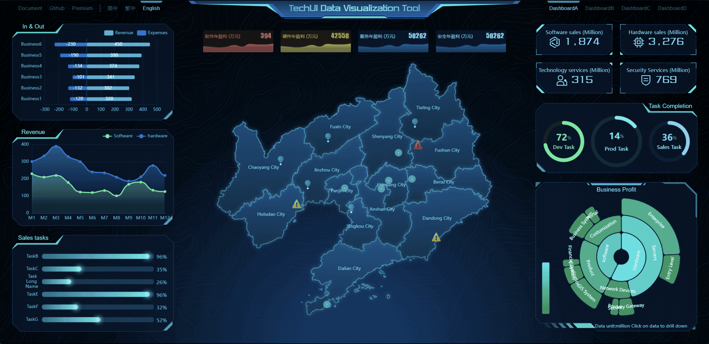
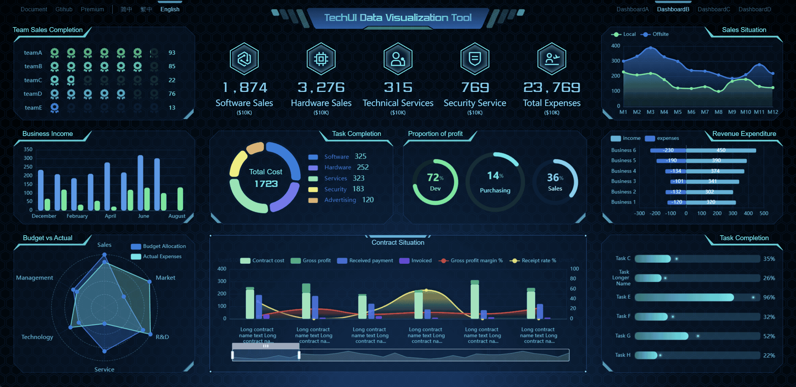
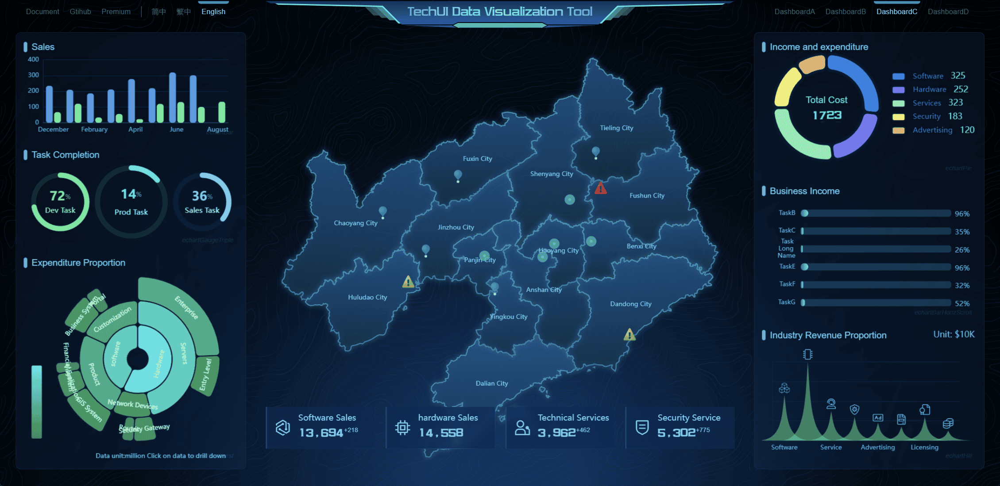
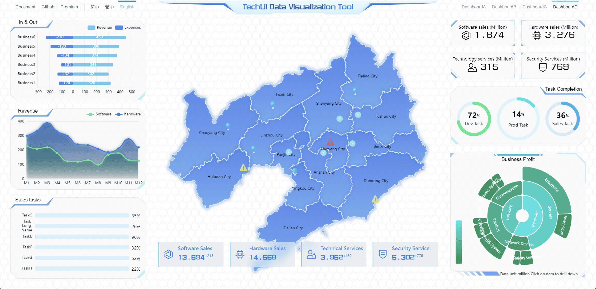

[简体中文](./README.cn.md) | [繁體中文](./README.hk.md) | English

<h1 align="center">
<b>TechUI-lite Development Kit</b>
</h1>

TechUI-lite is a free and easy to use Dynamic SVG Data Visualization Dashboard development tool, based on vite + vue3 development

   <a href="https://lite.techui.net/docs">Documentation</a> •
   <a href="https://lite.techui.net/">Demo Site</a> •
   <a href="https://www.npmjs.com/package/techui-vue3-lite">Core library</a> •
   <a href="https://techui.net/docs">Premium</a> •
   <a href="https://t.me/ayin86cn">Telgram</a>

## 💖Need A Remote Job
**I am planning to quit my job and if anyone can offer a long term remote job, please contact me. All my skills and frameworks are free to use if a partnership is reached.**

-----

## 🛡️ Announcements

**techUI-Lite framework is completely free, free to use without restrictions, its core files are non-open source and published on NPM server**

**If you find this framework helpful to you, please give me a star, I will be more motivated to develop more free frameworks. I have so many great ideas.**

**If the number of stars reaches 500, I will transplant the premium version of adaptivePanel to the lite version.**

There is also a paid Premium version, which provides more powerful features, related documentation and demos please visit here [TechUI-Premium](https://techui.net/docs)

Note: The SVG material and code in the framework are limited to use in the framework, please do not extract them for other purposes.

**This development kit has 4 built-in data screens, as shown in the figure below.**

**Demo Gif animations**

**Data Screen A**

**Data Screen B**

**Data Screen C**

**Data Screen D**

**For more demos, please refer to [TechUI-Lite-Demo](https://lite.techui.net/)**

-----

## ✨Features

- **🖥️Full port adaptation**

   Perfect ratio adaptation solution, personal computer, mobile phone, tablet, enterprise splicing screen, it can be said that most terminal devices can be perfectly adapted.

- **🛸Free Development Unlimited**

   Using popular technology stacks such as vite and vue3, by calling self-developed components and chart components, it can be quickly deployed and launched without too much tedious development process, which greatly shortens the development cycle. It has truly achieved free development at the source code level.

- **📊Enterprise Splicing Screen**

   In the face of enterprise-level splicing screens, we have a lot of display solutions, which can be customized and developed according to the customer's splicing screen equipment. The best display effect can be achieved under any device.

- **🧩De-bitmapping full use of Dynamic SVG**

   Comprehensive vectorization (de-bitmapping), due to the special use scene of large-screen visualization, the details of graphics are blurred when traditional bitmaps are used, but the original detail clarity can be maintained after zooming in on vector graphics.

- **🚀Stable iteration and rapid response**

   This framework has gone through multiple version iterations, bug fixes are timely, function expansion is progressing steadily, and the Lite version and Premium are updated synchronously.

- **🧑‍🚀Completely free, use freely**

   The lite version is completely free, without any usage restrictions, and can be used for any type of product, project etc.

-----

## 📜 Update Description

- **20230714 techui-vue3-lite-ver3.5 Lite is officially released, and its SVG element node calculation uses WASM component calculation to return**

-----
## 📖Installation Tutorial

1. `cnpm i` installs dependencies
2. `npm run dev` starts the project and you can preview it

For the introduction and usage of the development kit, please refer to [Documentation](https://techui.net/docs)

-----

## 🛠️ Compatibility and Nodejs Versions

1. nodejs 16-18 well supported other versions not tested
2. well supported by all major browsers except IE, including mobile browsers.

-----

## 🌟 Cooperation negotiation

The Lite version framework is free to use and does not provide any technical support. If you encounter any problems, please submit issues on github。

Or add [TechUI discord](https://discord.gg/JXgn5Gq2) to the discussion group.

Or add [TechUI Telgram](https://t.me/+RJZ4cmDrcCFmNWNl) to the discussion group.

For paid services, such as custom development, technical support, or purchasing a premium license, please contact me via the following contact information

WhatsApp scan the QR code below.

Or contact me via Telegram [@ayin86cn](https://t.me/ayin86cn)

You can also contact me via email ayin86cn@gmail.com I will check my email every 1-3 days

-----

## ❤️ What I can offer

The author himself, a UI designer turned front-end developer, has been in the field for 15 years and can take on the responsibilities of product manager, UI designer and front-end developer in a project or product development.

Therefore, it can be said to be the best and cost-effective partner for a start-up company, welcome to discuss cooperation. I hope to find a stable and long-term remote job. Preferably a remote job in Canada, hope to have the opportunity to go to this country.

#### Specific tasks that can be done

- UI design
- Planning and design of products and projects
- Visualization project development
- GEO project development (echarts+geojson+online map)
- Rust development of WASM modules
- Any type of business system
- APP development
- Documentation compilation
- Front-end security, encryption and decryption
